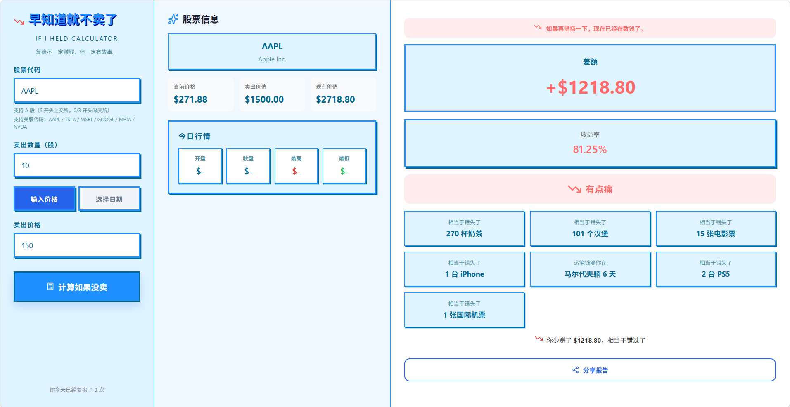

# If-I-Held

一个轻量有趣的股票复盘小工具：  
输入"当时卖出的价格和数量"，快速计算"如果没卖，现在会怎样"。

## 界面预览



**三列卡片布局**：
- 左列：表单输入（股票代码、卖出数量、卖出价格/日期）
- 中列：股票信息（当前价格、今日行情）
- 右列：结果分析（差额、收益率、情绪文案、机会成本对比）

## 功能简介

- 支持 A 股（6 位数代码）和美股手动输入
- 两种输入模式：直接输入卖出价格 / 选择卖出日期自动获取收盘价
- 实时价格获取（Yahoo Finance API），失败时自动使用兜底数据
- 今日行情展示：开盘价、收盘价、最高价、最低价
- 正确的货币符号显示（A股¥，美股$）
- 毒舌情绪文案（根据收益率分级）
- 机会成本对比（奶茶、汉堡、电影票、iPhone、马尔代夫天数、PS5、国际机票）

## 技术栈

- React 18
- TypeScript
- Vite
- Axios
- Lucide React Icons

## 本地运行

### 方式 1：使用 bat 脚本（Windows）

双击项目根目录下的 `start.bat` 即可。

脚本会自动：
- 检查 Node.js / npm
- 首次安装依赖（`npm install`）
- 启动开发服务器（`npm run dev`）

### 方式 2：手动命令

```bash
npm install
npm run dev
```

启动后访问 `http://localhost:5123`。

## 打包构建

```bash
npm run build
npm run preview
```

## 项目结构

```text
.
├─ src/
│  ├─ App.tsx        # 主页面与核心计算逻辑
│  ├─ main.tsx       # 入口
│  └─ index.css      # 全局样式
├─ assets/
│  └─ ScreenShot_2026-05-01_003428_494.png # 界面截图
├─ start.bat         # Windows 一键启动脚本
├─ index.html
├─ package.json
└─ vite.config.ts
```

## 注意事项

- 股票代码仅支持手动输入，不提供下拉列表
- 实时价格来源于公开接口，请求可能受网络或跨域策略影响
- 本项目仅供娱乐，不构成任何投资建议

## License

MIT
